# Modelo entidad-relación

Columnas, tipos, restricciones e índices: ver el [diccionario de datos](data-dictionary.md). Versiones renderizadas en [docs/diagrams](../diagrams/README.md).

> Revisión 2: los 10 diagramas originales se dividieron en **19** (1a–1c, 2a–2b, 3, 4a–4b, 5, 6a–6c, 7, 8a–8b, 9, 10a–10c) porque los diagramas con muchas relaciones a `TENANTS` o a la entidad principal generaban cruces ilegibles. Las autorrelaciones (camarote → camas, nota de crédito → comprobante) se documentan en texto.

## Convenciones

- Tablas en `snake_case` plural. PK `id uuid` (UUID v7). Todas las tablas de tenant tienen `tenant_id` + `UNIQUE (tenant_id, id)`, y las FK entre ellas son **compuestas** con `tenant_id`.
- Auditoría de fila: `created_at`, `updated_at`, `created_by_membership_id` (cuando aplica). Borrado lógico mediante `status` o `archived_at`. **No** se usa `ON DELETE CASCADE` hacia datos operativos; por defecto es `RESTRICT`. `CASCADE` solo en hijos puramente compositivos de una entidad en borrador (p. ej., elementos de una versión de layout `DRAFT`).
- Dinero: `numeric(14,2)` + `currency char(3)`. Pesos: `numeric(12,3)` en kg. Dimensiones: `numeric(10,2)` en cm. Volumen: `numeric(12,6)` en m³.
- Enumeraciones **cerradas** (estados de máquinas de estado) como `enum` de PostgreSQL vía Prisma. Categorías **abiertas** (tipos de vehículo, tipos de mercancía, motivos) como **tablas de catálogo**, nunca como enum.
- Leyenda: 🌐 = tabla global (sin `tenant_id`).

## 1. Plataforma SaaS

### 1a. Tenant y configuración

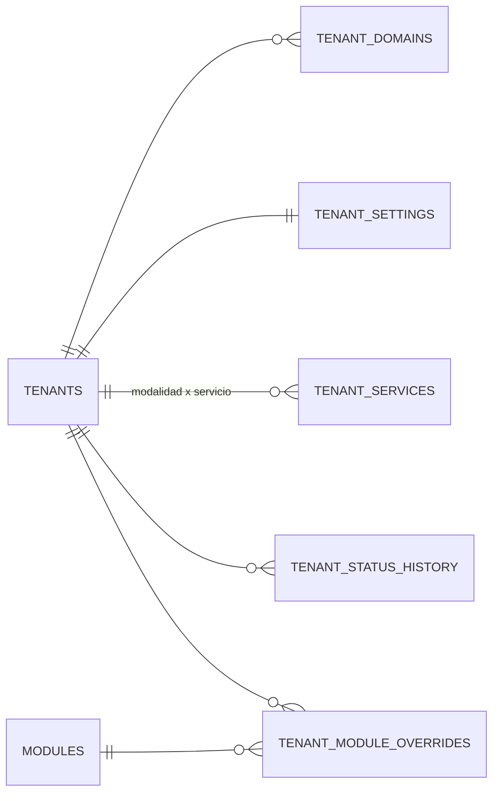
```mermaid
erDiagram
  direction LR
  TENANTS ||--o{ TENANT_DOMAINS : ""
  TENANTS ||--|| TENANT_SETTINGS : ""
  TENANTS ||--o{ TENANT_SERVICES : "modalidad x servicio"
  TENANTS ||--o{ TENANT_STATUS_HISTORY : ""
  TENANTS ||--o{ TENANT_MODULE_OVERRIDES : ""
  MODULES ||--o{ TENANT_MODULE_OVERRIDES : ""
```

### 1b. Planes, suscripción, medición y facturación SaaS

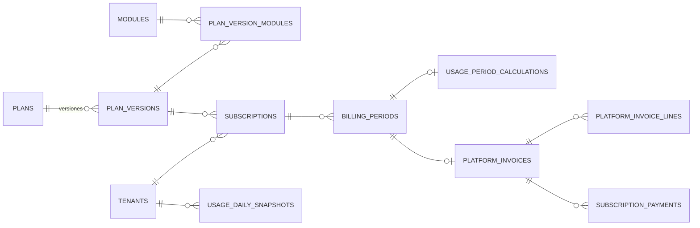
```mermaid
erDiagram
  direction LR
  PLANS ||--o{ PLAN_VERSIONS : "versiones"
  PLAN_VERSIONS ||--o{ PLAN_VERSION_MODULES : ""
  MODULES ||--o{ PLAN_VERSION_MODULES : ""
  TENANTS ||--o{ SUBSCRIPTIONS : ""
  PLAN_VERSIONS ||--o{ SUBSCRIPTIONS : ""
  SUBSCRIPTIONS ||--o{ BILLING_PERIODS : ""
  TENANTS ||--o{ USAGE_DAILY_SNAPSHOTS : ""
  BILLING_PERIODS ||--o| USAGE_PERIOD_CALCULATIONS : ""
  BILLING_PERIODS ||--o| PLATFORM_INVOICES : ""
  PLATFORM_INVOICES ||--o{ PLATFORM_INVOICE_LINES : ""
  PLATFORM_INVOICES ||--o{ SUBSCRIPTION_PAYMENTS : ""
```

### 1c. Soporte

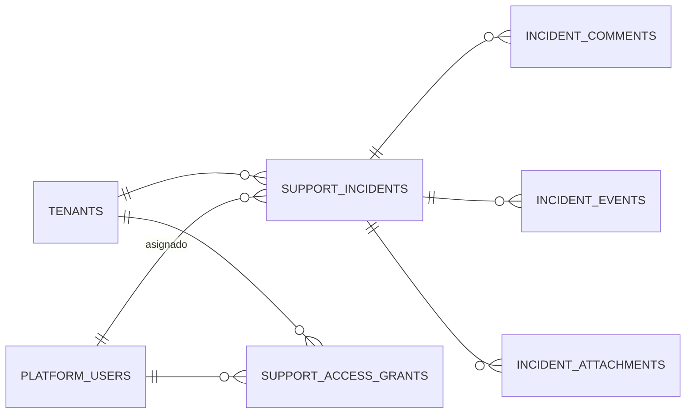
```mermaid
erDiagram
  direction LR
  TENANTS ||--o{ SUPPORT_INCIDENTS : ""
  PLATFORM_USERS ||--o{ SUPPORT_INCIDENTS : "asignado"
  SUPPORT_INCIDENTS ||--o{ INCIDENT_COMMENTS : ""
  SUPPORT_INCIDENTS ||--o{ INCIDENT_EVENTS : ""
  SUPPORT_INCIDENTS ||--o{ INCIDENT_ATTACHMENTS : ""
  TENANTS ||--o{ SUPPORT_ACCESS_GRANTS : ""
  PLATFORM_USERS ||--o{ SUPPORT_ACCESS_GRANTS : ""
```

🌐 `tenants`, `tenant_domains`, `modules`, `plans`, `plan_versions`, `plan_version_modules`, `platform_users`, `platform_invoices`, `support_incidents` (contienen `tenant_id`, pero las gestiona `yebo_platform`. El tenant las ve mediante una vista filtrada con RLS: el tenant consulta sus incidencias y facturas).

## 2. Identidad y acceso

### 2a. Usuarios, membresías y permisos

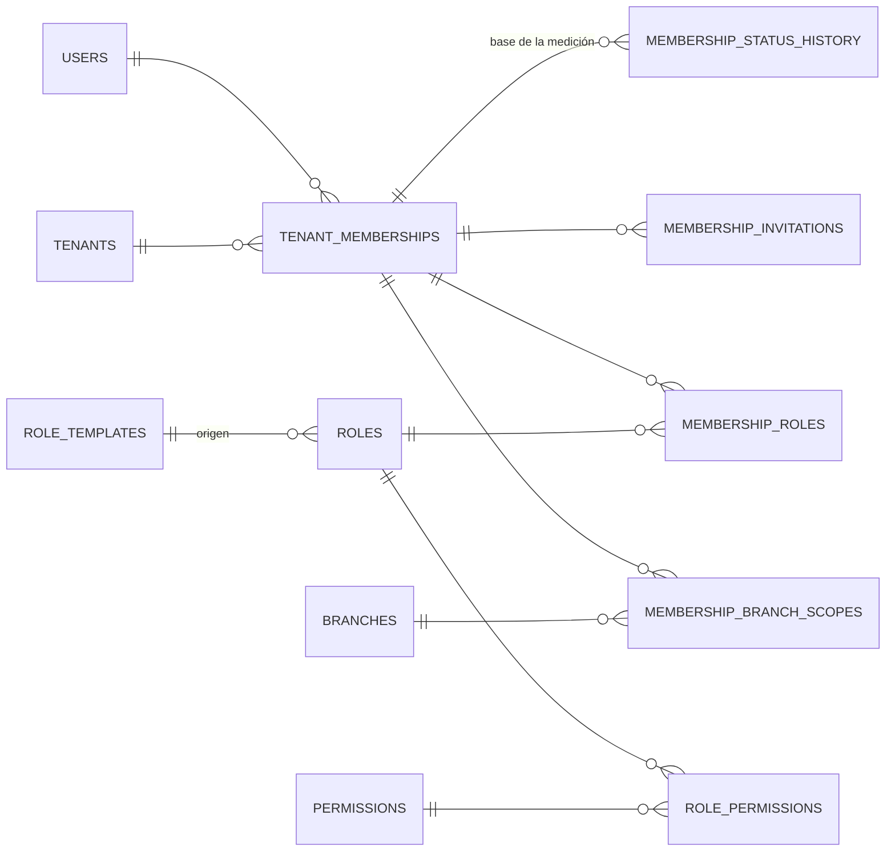
```mermaid
erDiagram
  direction LR
  USERS ||--o{ TENANT_MEMBERSHIPS : ""
  TENANTS ||--o{ TENANT_MEMBERSHIPS : ""
  TENANT_MEMBERSHIPS ||--o{ MEMBERSHIP_STATUS_HISTORY : "base de la medición"
  TENANT_MEMBERSHIPS ||--o{ MEMBERSHIP_INVITATIONS : ""
  TENANT_MEMBERSHIPS ||--o{ MEMBERSHIP_ROLES : ""
  ROLES ||--o{ MEMBERSHIP_ROLES : ""
  ROLE_TEMPLATES ||--o{ ROLES : "origen"
  ROLES ||--o{ ROLE_PERMISSIONS : ""
  PERMISSIONS ||--o{ ROLE_PERMISSIONS : ""
  TENANT_MEMBERSHIPS ||--o{ MEMBERSHIP_BRANCH_SCOPES : ""
  BRANCHES ||--o{ MEMBERSHIP_BRANCH_SCOPES : ""
```

### 2b. Sesiones, cuentas de servicio y dispositivos

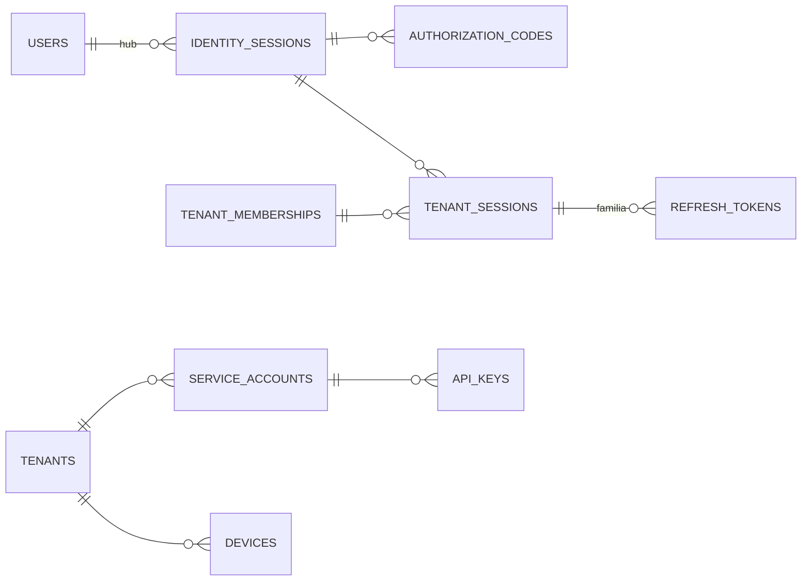
```mermaid
erDiagram
  direction LR
  USERS ||--o{ IDENTITY_SESSIONS : "hub"
  IDENTITY_SESSIONS ||--o{ AUTHORIZATION_CODES : ""
  IDENTITY_SESSIONS ||--o{ TENANT_SESSIONS : ""
  TENANT_MEMBERSHIPS ||--o{ TENANT_SESSIONS : ""
  TENANT_SESSIONS ||--o{ REFRESH_TOKENS : "familia"
  TENANTS ||--o{ SERVICE_ACCOUNTS : ""
  SERVICE_ACCOUNTS ||--o{ API_KEYS : ""
  TENANTS ||--o{ DEVICES : ""
```

🌐 `users`, `identity_sessions`, `tenant_sessions`, `refresh_tokens`, `authorization_codes`, `permissions`, `role_templates`, `password_reset_tokens`.

## 3. Organización, ubicaciones y canales

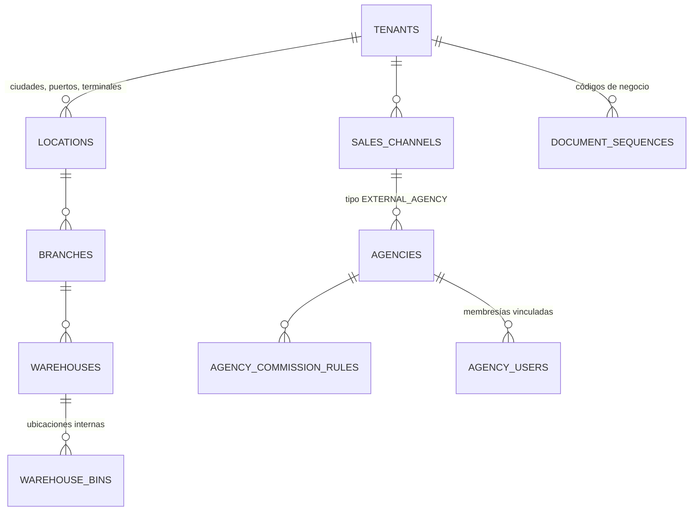
```mermaid
erDiagram
  TENANTS ||--o{ LOCATIONS : "ciudades, puertos, terminales"
  LOCATIONS ||--o{ BRANCHES : ""
  BRANCHES ||--o{ WAREHOUSES : ""
  WAREHOUSES ||--o{ WAREHOUSE_BINS : "ubicaciones internas"
  TENANTS ||--o{ SALES_CHANNELS : ""
  SALES_CHANNELS ||--o{ AGENCIES : "tipo EXTERNAL_AGENCY"
  AGENCIES ||--o{ AGENCY_COMMISSION_RULES : ""
  AGENCIES ||--o{ AGENCY_USERS : "membresías vinculadas"
  TENANTS ||--o{ DOCUMENT_SEQUENCES : "códigos de negocio"
```

## 4. Flota y layouts

### 4a. Vehículos y propietarios

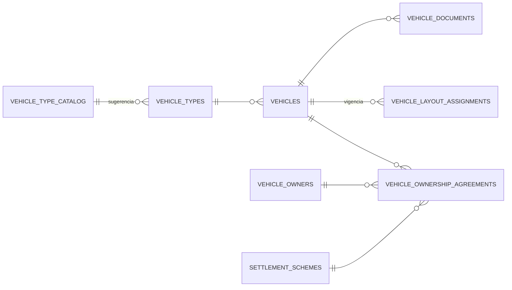
```mermaid
erDiagram
  direction LR
  VEHICLE_TYPE_CATALOG ||--o{ VEHICLE_TYPES : "sugerencia"
  VEHICLE_TYPES ||--o{ VEHICLES : ""
  VEHICLES ||--o{ VEHICLE_DOCUMENTS : ""
  VEHICLES ||--o{ VEHICLE_LAYOUT_ASSIGNMENTS : "vigencia"
  VEHICLE_OWNERS ||--o{ VEHICLE_OWNERSHIP_AGREEMENTS : ""
  VEHICLES ||--o{ VEHICLE_OWNERSHIP_AGREEMENTS : ""
  SETTLEMENT_SCHEMES ||--o{ VEHICLE_OWNERSHIP_AGREEMENTS : ""
```

### 4b. Plantillas de distribución (layouts)

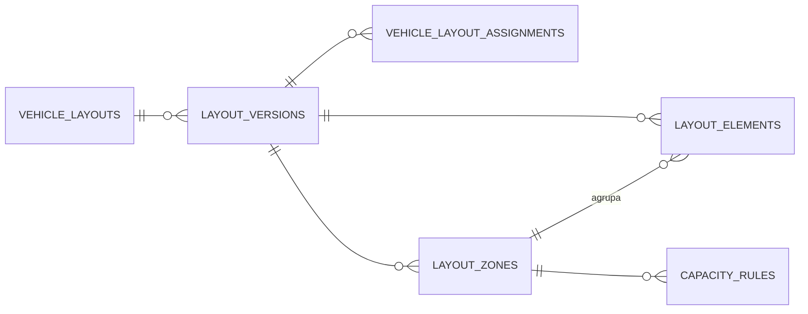
```mermaid
erDiagram
  direction LR
  VEHICLE_LAYOUTS ||--o{ LAYOUT_VERSIONS : ""
  LAYOUT_VERSIONS ||--o{ VEHICLE_LAYOUT_ASSIGNMENTS : ""
  LAYOUT_VERSIONS ||--o{ LAYOUT_ZONES : ""
  LAYOUT_VERSIONS ||--o{ LAYOUT_ELEMENTS : ""
  LAYOUT_ZONES ||--o{ LAYOUT_ELEMENTS : "agrupa"
  LAYOUT_ZONES ||--o{ CAPACITY_RULES : ""
```

`layout_elements.parent_element_id` → `layout_elements` (camarote → camas; autorrelación omitida en el diagrama).

## 5. Rutas, viajes e inventario

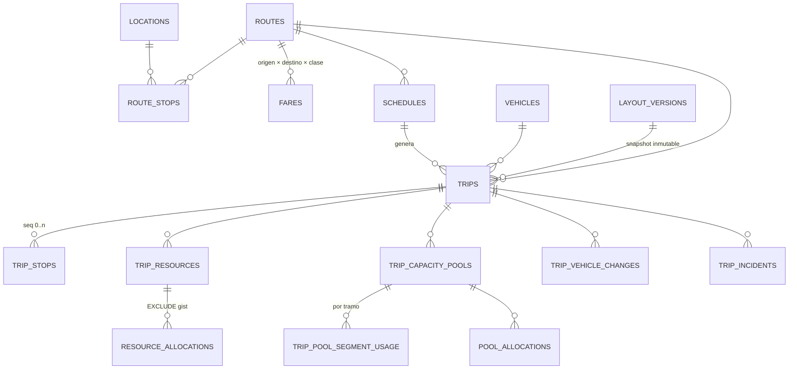
```mermaid
erDiagram
  ROUTES ||--o{ ROUTE_STOPS : ""
  LOCATIONS ||--o{ ROUTE_STOPS : ""
  ROUTES ||--o{ FARES : "origen × destino × clase"
  ROUTES ||--o{ SCHEDULES : ""
  SCHEDULES ||--o{ TRIPS : "genera"
  ROUTES ||--o{ TRIPS : ""
  VEHICLES ||--o{ TRIPS : ""
  LAYOUT_VERSIONS ||--o{ TRIPS : "snapshot inmutable"
  TRIPS ||--o{ TRIP_STOPS : "seq 0..n"
  TRIPS ||--o{ TRIP_RESOURCES : ""
  TRIPS ||--o{ TRIP_CAPACITY_POOLS : ""
  TRIP_CAPACITY_POOLS ||--o{ TRIP_POOL_SEGMENT_USAGE : "por tramo"
  TRIP_RESOURCES ||--o{ RESOURCE_ALLOCATIONS : "EXCLUDE gist"
  TRIP_CAPACITY_POOLS ||--o{ POOL_ALLOCATIONS : ""
  TRIPS ||--o{ TRIP_VEHICLE_CHANGES : ""
  TRIPS ||--o{ TRIP_INCIDENTS : ""
```

## 6. Clientes, ventas, pagos, caja e impuestos

### 6a. Clientes, ventas, canales e impuestos

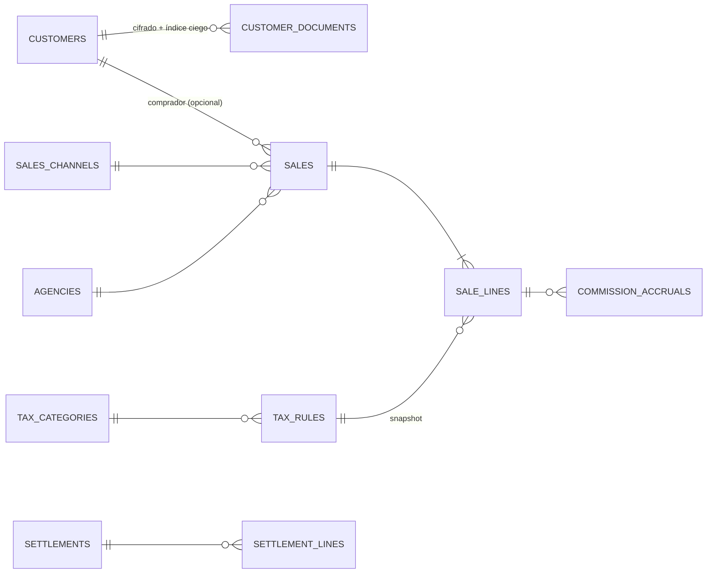
```mermaid
erDiagram
  direction LR
  CUSTOMERS ||--o{ CUSTOMER_DOCUMENTS : "cifrado + índice ciego"
  CUSTOMERS ||--o{ SALES : "comprador (opcional)"
  SALES_CHANNELS ||--o{ SALES : ""
  AGENCIES ||--o{ SALES : ""
  SALES ||--|{ SALE_LINES : ""
  TAX_CATEGORIES ||--o{ TAX_RULES : ""
  TAX_RULES ||--o{ SALE_LINES : "snapshot"
  SALE_LINES ||--o{ COMMISSION_ACCRUALS : ""
  SETTLEMENTS ||--o{ SETTLEMENT_LINES : ""
```

`sale_lines` referencia **exactamente un** origen: `booking_item_id`, `luggage_charge_id`, `shipment_id`, `cargo_order_id` o `manual_concept_id` (restricción `CHECK (num_nonnulls(...) = 1)`).

### 6b. Pagos, devoluciones y caja

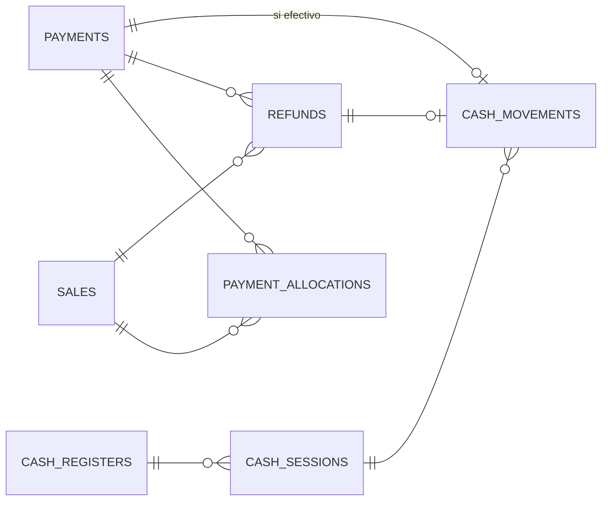
```mermaid
erDiagram
  direction LR
  SALES ||--o{ PAYMENT_ALLOCATIONS : ""
  PAYMENTS ||--o{ PAYMENT_ALLOCATIONS : ""
  SALES ||--o{ REFUNDS : ""
  PAYMENTS ||--o{ REFUNDS : ""
  CASH_REGISTERS ||--o{ CASH_SESSIONS : ""
  CASH_SESSIONS ||--o{ CASH_MOVEMENTS : ""
  PAYMENTS ||--o| CASH_MOVEMENTS : "si efectivo"
  REFUNDS ||--o| CASH_MOVEMENTS : ""
```

### 6c. Facturación electrónica

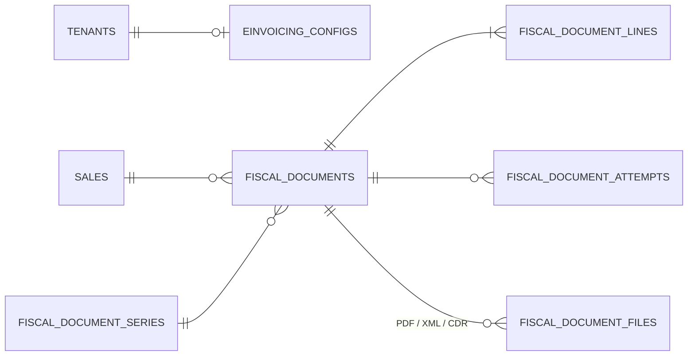
```mermaid
erDiagram
  direction LR
  TENANTS ||--o| EINVOICING_CONFIGS : ""
  SALES ||--o{ FISCAL_DOCUMENTS : ""
  FISCAL_DOCUMENT_SERIES ||--o{ FISCAL_DOCUMENTS : ""
  FISCAL_DOCUMENTS ||--|{ FISCAL_DOCUMENT_LINES : ""
  FISCAL_DOCUMENTS ||--o{ FISCAL_DOCUMENT_ATTEMPTS : ""
  FISCAL_DOCUMENTS ||--o{ FISCAL_DOCUMENT_FILES : "PDF / XML / CDR"
```

Una nota de crédito es un `fiscal_document` con `related_document_id` → comprobante original (autorrelación; se omite en el diagrama para mantenerlo legible).

## 7. Pasajeros

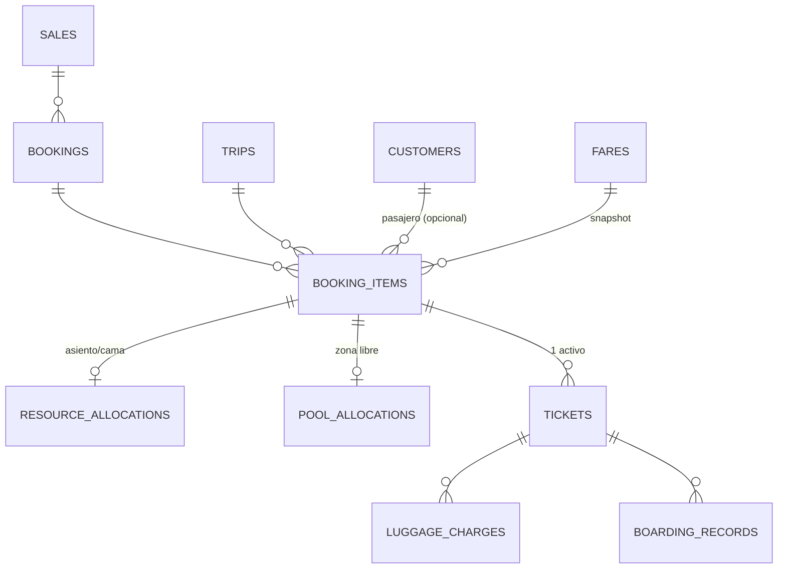
```mermaid
erDiagram
  BOOKINGS ||--o{ BOOKING_ITEMS : ""
  TRIPS ||--o{ BOOKING_ITEMS : ""
  CUSTOMERS ||--o{ BOOKING_ITEMS : "pasajero (opcional)"
  BOOKING_ITEMS ||--o| RESOURCE_ALLOCATIONS : "asiento/cama"
  BOOKING_ITEMS ||--o| POOL_ALLOCATIONS : "zona libre"
  FARES ||--o{ BOOKING_ITEMS : "snapshot"
  BOOKING_ITEMS ||--o{ TICKETS : "1 activo"
  TICKETS ||--o{ LUGGAGE_CHARGES : ""
  TICKETS ||--o{ BOARDING_RECORDS : ""
  SALES ||--o{ BOOKINGS : ""
```

## 8. Encomiendas y logística

### 8a. Registro, tarifa y entrega

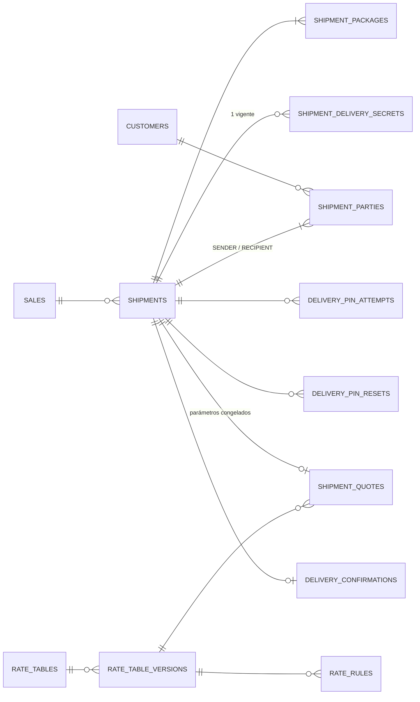
```mermaid
erDiagram
  direction LR
  SALES ||--o{ SHIPMENTS : ""
  SHIPMENTS ||--|{ SHIPMENT_PACKAGES : ""
  SHIPMENTS ||--|{ SHIPMENT_PARTIES : "SENDER / RECIPIENT"
  CUSTOMERS ||--o{ SHIPMENT_PARTIES : ""
  RATE_TABLES ||--o{ RATE_TABLE_VERSIONS : ""
  RATE_TABLE_VERSIONS ||--o{ RATE_RULES : ""
  RATE_TABLE_VERSIONS ||--o{ SHIPMENT_QUOTES : ""
  SHIPMENTS ||--o| SHIPMENT_QUOTES : "parámetros congelados"
  SHIPMENTS ||--o{ SHIPMENT_DELIVERY_SECRETS : "1 vigente"
  SHIPMENTS ||--o{ DELIVERY_PIN_ATTEMPTS : ""
  SHIPMENTS ||--o{ DELIVERY_PIN_RESETS : ""
  SHIPMENTS ||--o| DELIVERY_CONFIRMATIONS : ""
```

### 8b. Traslados y seguimiento

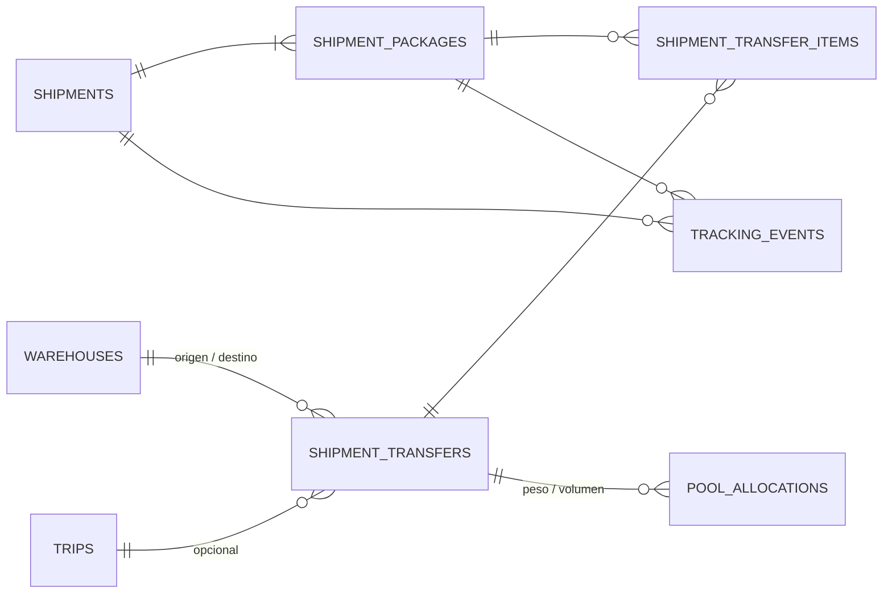
```mermaid
erDiagram
  direction LR
  SHIPMENTS ||--|{ SHIPMENT_PACKAGES : ""
  SHIPMENT_PACKAGES ||--o{ SHIPMENT_TRANSFER_ITEMS : ""
  SHIPMENT_TRANSFERS ||--o{ SHIPMENT_TRANSFER_ITEMS : ""
  WAREHOUSES ||--o{ SHIPMENT_TRANSFERS : "origen / destino"
  TRIPS ||--o{ SHIPMENT_TRANSFERS : "opcional"
  SHIPMENT_TRANSFERS ||--o{ POOL_ALLOCATIONS : "peso / volumen"
  SHIPMENTS ||--o{ TRACKING_EVENTS : ""
  SHIPMENT_PACKAGES ||--o{ TRACKING_EVENTS : ""
```

## 9. Carga y vehículos transportados

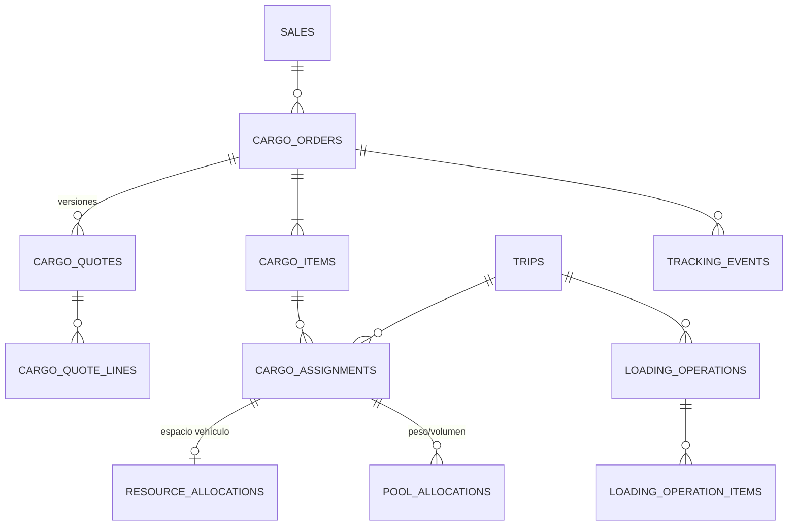
```mermaid
erDiagram
  CARGO_ORDERS ||--|{ CARGO_ITEMS : ""
  CARGO_ORDERS ||--o{ CARGO_QUOTES : "versiones"
  CARGO_QUOTES ||--o{ CARGO_QUOTE_LINES : ""
  CARGO_ITEMS ||--o{ CARGO_ASSIGNMENTS : ""
  TRIPS ||--o{ CARGO_ASSIGNMENTS : ""
  CARGO_ASSIGNMENTS ||--o| RESOURCE_ALLOCATIONS : "espacio vehículo"
  CARGO_ASSIGNMENTS ||--o{ POOL_ALLOCATIONS : "peso/volumen"
  TRIPS ||--o{ LOADING_OPERATIONS : ""
  LOADING_OPERATIONS ||--o{ LOADING_OPERATION_ITEMS : ""
  CARGO_ORDERS ||--o{ TRACKING_EVENTS : ""
  SALES ||--o{ CARGO_ORDERS : ""
```

## 10. Operación transversal

### 10a. Manifiestos, white label y archivos

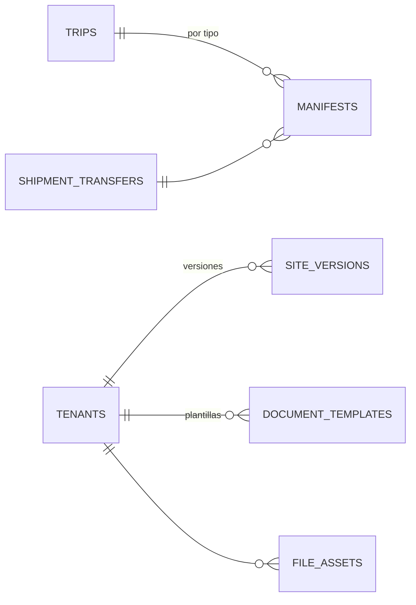
```mermaid
erDiagram
  direction LR
  TRIPS ||--o{ MANIFESTS : "por tipo"
  SHIPMENT_TRANSFERS ||--o{ MANIFESTS : ""
  TENANTS ||--o{ SITE_VERSIONS : "versiones"
  TENANTS ||--o{ DOCUMENT_TEMPLATES : "plantillas"
  TENANTS ||--o{ FILE_ASSETS : ""
```

### 10b. Notificaciones, outbox y dispositivos offline

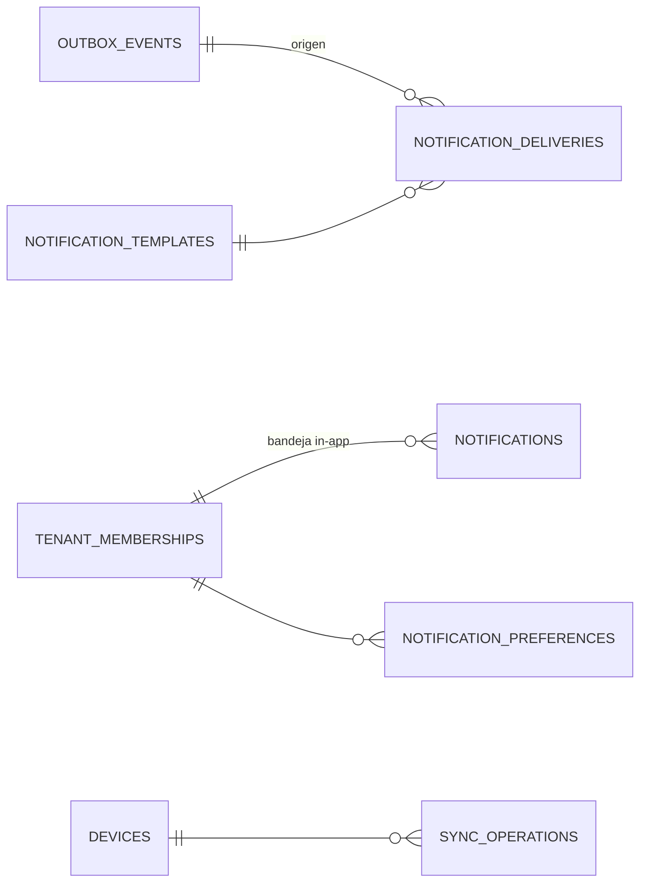
```mermaid
erDiagram
  direction LR
  OUTBOX_EVENTS ||--o{ NOTIFICATION_DELIVERIES : "origen"
  NOTIFICATION_TEMPLATES ||--o{ NOTIFICATION_DELIVERIES : ""
  TENANT_MEMBERSHIPS ||--o{ NOTIFICATIONS : "bandeja in-app"
  TENANT_MEMBERSHIPS ||--o{ NOTIFICATION_PREFERENCES : ""
  DEVICES ||--o{ SYNC_OPERATIONS : ""
```

### 10c. Protección de datos y auditoría

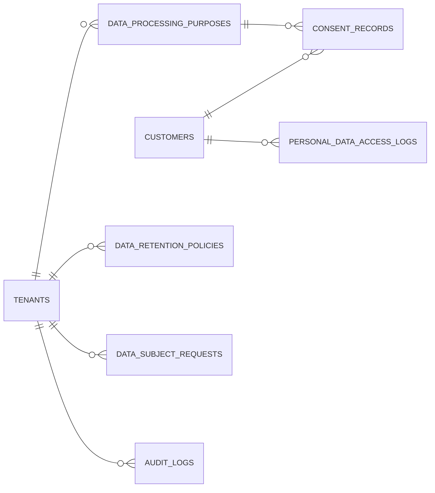
```mermaid
erDiagram
  direction LR
  TENANTS ||--o{ DATA_PROCESSING_PURPOSES : ""
  CUSTOMERS ||--o{ CONSENT_RECORDS : ""
  DATA_PROCESSING_PURPOSES ||--o{ CONSENT_RECORDS : ""
  TENANTS ||--o{ DATA_RETENTION_POLICIES : ""
  TENANTS ||--o{ DATA_SUBJECT_REQUESTS : ""
  CUSTOMERS ||--o{ PERSONAL_DATA_ACCESS_LOGS : ""
  TENANTS ||--o{ AUDIT_LOGS : ""
```

## Políticas de borrado e historial

| Entidad | Política |
|---|---|
| Tenant | Nunca se borra físicamente desde la app. `CANCELLED` + retención + purga manual auditada |
| Usuario / membresía | Membresía `REVOKED`; usuario `DISABLED`. Las referencias históricas se mantienen |
| Vehículo, ruta, tarifa, sucursal, almacén | `archived_at`. `RESTRICT` si hay operaciones |
| Versión de layout / tarifa / plan | Inmutable al publicar; solo se archiva |
| Venta, pago, comprobante, caja | Nunca se borran. Se corrigen con anulación, reembolso o asiento inverso |
| Eventos de tracking, auditoría, intentos PIN, intentos de facturación | *Append-only* |
| Datos personales | Anonimización según `data_retention_policies`, respetando plazos legales |
